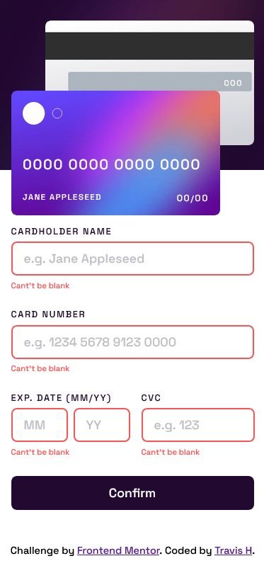

# Frontend Mentor - Interactive card details form solution

This is a solution to the [Interactive card details form challenge on Frontend Mentor](https://www.frontendmentor.io/challenges/interactive-card-details-form-XpS8cKZDWw). 

## Table of contents

- [Frontend Mentor - Interactive card details form solution](#frontend-mentor---interactive-card-details-form-solution)
  - [Table of contents](#table-of-contents)
  - [Overview](#overview)
    - [The challenge](#the-challenge)
    - [Screenshot](#screenshot)
    - [Links](#links)
  - [My process](#my-process)
    - [Built with](#built-with)
    - [Useful resources](#useful-resources)
  - [Author](#author)

## Overview

### The challenge

Users should be able to:

- Fill in the form and see the card details update in real-time
- Receive error messages when the form is submitted if:
  - Any input field is empty
  - The card number, expiry date, or CVC fields are in the wrong format
- View the optimal layout depending on their device's screen size
- See hover, active, and focus states for interactive elements on the page

### Screenshot

Desktop Views

Mobile Views

### Links

- Solution URL: [Solution URL](https://github.com/TravisH-bot/interactive-card-details-form-main)
- Live Site URL: [Live site URL](https://travish-bot.github.io/interactive-card-details-form-main/)

## My process

### Built with

- Semantic HTML5 markup
- CSS custom properties
- Flexbox
- Media Queries
- JavaScript

### Useful resources

- [Resource 1](https://stackoverflow.com/questions/51496204/border-gradient-with-border-radius) - This helped me with the linear gradient border with rounded corners when the input fields are in focus.
- [Resource 2](https://www.w3schools.com/howto/howto_css_hide_arrow_number.asp) - This is an great resource to hide the input arrows on input fields for numbers.

## Author

- Website - [Travis Hackbarth](https://travish-bot.github.io/My-Portfolio/)
- Frontend Mentor - [@TravisH-bot](https://www.frontendmentor.io/profile/TravisH-bot)
